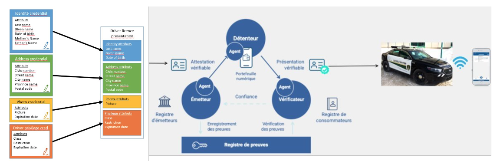

## Expérimentation pour intégrer le standard (ISO 18013-5) "Mobile driver's license" ou "mDL" aux attestations vérifiables.

## Prototypes

### Applications

Démontrer la faisabilité technique de l'intégration du standard ISO 18013-5, mDL aux attestations vérifiables.

- Émetteur du permis de conduire mobile: Pour que l'émetteur du permis de conduire mobile fonctionne, il a besoin de trois composants:
  - **Application web** qui sert de couche "frontend" de l'émetteur.
  - **API de l'agent ACA-Py** qui sert de couche "backend" de l'émetteur.
  - **Application mobile de portefeuille numérique** qui sert à:
    - Balayer le code QR que l'application frontend affiche.
    - Recevoir le permis de conduire mobile de l'API de l'agent ACA-Py avec les informations du code QR balayé .
- **ICP: Application d'Infrastructure à clé publique (PKI)**
  - TODO
- **Plugin ACA-Py**
  - TODO

## Cas à démontrer

### Conception d'un prototype représentant la réalité d'un émetteur
  - Création d'un mDL et de l'attestation vérifiable
  - Création d'un registre chez l'émetteur

### Conception d'un prototype représentant la réalité d'un vérificateur
  - Création du registre de consommateur
  - Création des étapes de vérification de l'attestation mDL

### Conception d'un prototype représentant la réalité d'un détenteur
  - Création de l'environnement représentatif du portefeuille numérique conservé sur le téléphone ou la tablette de l'individu
  - Insertion du mDL dans le portefeuille numérique
  - Création des étapes de validation de transfert d'information vers le vérificateur de l'attestation

### Conception d’un prototype de registre de preuves​
  - Création de l’environnement représentatif du registre de preuves permettant de valider l’interopérabilité à l’échelle nord-américaine et ultimement à l’international​

### Validation de l’atteinte des objectifs d’expérimentation après chaque phase de prototypage. ​

### Consultations auprès des utilisateurs finaux et de la communauté de pratique mDL/eID de l’atteinte des objectifs d’expérimentation. ​

## Architecture de la solution

**Architecture Haut Niveau**

