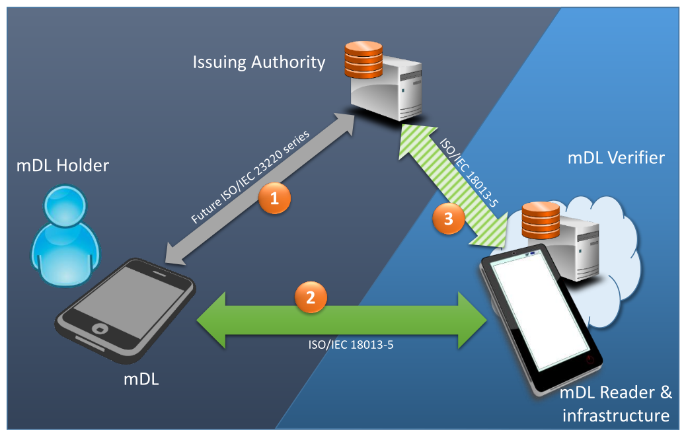

<!-- ENTETE -->

---

<!-- FIN ENTETE -->

# Expérimentation pour intégrer le standard (ISO 18013-5) "Mobile driver's license" ou "mDL" aux attestations vérifiables.

## 1. Objectifs 

L'objectif principal de cette expérimentation est d’explorer la création d’un permis de conduire mobile. Cet objectif se décline en plusieurs sous-objectifs tels que : 

- Démontrer la faisabilité technique d’un permis de conduire numérique compatible à la fois aux orientations nationales en matière d’identité numérique et aux normes internationales en lien avec le permis de conduire numérique.  

- Créer une attestation vérifiable et un registre d’attestation. 

- Créer un registre de consommateurs et expliciter les étapes de vérification du permis de conduire mobile 

- Créer un environnement représentatif du portefeuille numérique sur appareil mobile et assurer l’acheminement sécurisé du permis de conduire numérique.  

- Créer un environnement représentatif du registre de preuves permettant de valider l’interopérabilité à l’échelle nord-américaine.  

- Évaluer l'expérience utilisateur des utilisateurs finaux (propriétaire du permis et contrôleurs routiers)   

Ainsi, cette expérimentation vise à tester et essayer les normes et règles statuées pour la création et utilisation de permis de conduire numériques (mDL - Mobile Driver's Licence). On établi comme buts à atteindre lors de cette expérimentation les facteurs suivants: 

- Durant la phase préparatoire, obtenir des formations permettant une mise à niveau des connaissances technologiques requises pour mener à bien les activités de prototypage et d’expérimentations​

- Obtenir l’appui d’experts du domaine à certains moments clé des expérimentations (ex. permis, technologies mDL, technologies chaînes de blocs)

- Partage de l’état d’avancement de nos expérimentations avec les communautés open source des technologies impliqués et obtenir des rétroactions (ex. JEDI, employés de différentes juridictions canadiennes)

- Accès aux outils dont dispose les contrôleurs routiers dans le cadre de leur travail (ex. cellulaires, tablettes)

- Participation des équipes spécialisées en recherche d'expérience client  

- Collaboration avec spécialistes d'autres provinces lors de certains moments clés des expérimentations

Au terme de cette expérimentation, nous souhaitions matérialiser l’entièreté du cycle de vie d’un permis de conduire mobile. En cas de succès, nous pourrions obtenir des informations utiles sur le fonctionnement du permis de conduire mobile, ainsi que sur l’expérience des différents utilisateurs finaux. Ces informations devraient constituer un substrat de qualité pour des initiatives futurs sur le développement d’un permis de conduire mobile au Québec et en Amérique du Nord. 

## 2. Contexte 

Depuis quelques années des normes et standards encadrant le déploiement des **permis de conduire numériques (Mobile Driver’s License – mDL)** ainsi que de **l’identité numérique (Digital Identity – eID)** à l’échelle internationale ont été publiés. Dans le domaine de la sécurité routière, la **norme ISO 18013-5 (mDL)** ainsi que des normes de **l’American Association of Motor Vehicle Administrators (AAMVA)** viennent encadrer le déploiement du permis de conduire numérique sur appareil mobile, et ce, pour la région nord-américaine. Au Canada et au Québec, le **Pan-Canadian Trust Framework (PCTF)** du **Digital Identity and Authentication Council of Canada (DIACC)** [[ *ainsi que les orientations du programme gouvernemental du Service québécois d’identité numérique (SQIN)* ??? ]] viennent établir les grandes orientations et balises pour le déploiement de l’identité numérique. ​

Les orientations, les cadres et les technologies soutenant le déploiement du permis de conduire numérique ainsi que de l’identité numérique à l’échelle nationale et internationale évoluent en parallèle et présentent certains manquements en termes d’interopérabilité et de compatibilité afin d’assurer la viabilité à court terme de ces concepts dans le monde réel. ​

Dans un souci d’expérience utilisateur intuitive et à valeur ajoutée, de compatibilité technologique en plus de l’acceptabilité par les parties prenantes essentielles tels que les forces de l’ordre, les contrôleurs routiers et les usagers de la route, le `Centre Québécois d’Excellence numérique (CQEN)` developpe un prototype québécois du permis de conduire numérique qui sera à la fois arrimé avec les orientations gouvernementales en matière d’identité numérique ainsi que le cadre mDL établi par l’AAMVA. 

Le CQEN expérimente ainsi le prototypage d’un permis de conduire numérique. Il s’agit d’une représentation numérique du permis de conduire physique traditionnel stockée et accessible à l’aide d’un dispositif mobile comme un téléphone intelligent ou une tablette. Comme pour son équivalent physique, le permis de conduire numérique fait l’objet d’une suite de standards émis à l’échelle internationale par l’Organisation International de Standardisation (ISO). La norme ISO 18013-5 établit des spécifications techniques sur le stockage et l’interface pour la vérification du document. Cela inclut notamment des règles strictes sur les modèles de données, l’échange de données entre le détenteur et le vérificateur, ainsi que des mécanismes de sécurité pour protéger son intégrité et son authenticité.  

Au reste, pour le volet émission du document, la norme donne des lignes directrices sur la gouvernance, laissant le soin aux autorités émettrices et à leur association régionale de déterminer les spécifications techniques complémentaires pour se conformer au cadre légal et règlementaire. Pour l’Amérique du Nord, l’AAMVA (American Association of Motor Vehicle Administrators) a édicté des recommandations pour l’émission d’un permis de conduire numérique. Elle mentionne notamment la création d’une liste **vérifiée des autorités émettrices de certificats (VICAL)**, qui contient les clés publiques des autorités émettrices et garantit leur fiabilité.  

L’expérimentation a un caractère autonome et n’entretient aucune relation directe avec les autres initiatives du gouvernement en matière d’identité numérique. Toutefois, lorsqu’on dépasse les frontières de l’expérimentation, les permis de conduire numérique et l’identité numérique entretiennent un rapport étroit. Il devient donc essentiel de prendre en compte le cadre de confiance établit en matière d’identité numérique, grâce à l’enchevêtrement des principes édictés par le Conseil d’identification et d’authentification numériques du Canada (CCIAN) et les orientations du programme gouvernemental du Service québécois d’identité numérique (SQIN) dans la réalisation de l’expérimentation. 

Dans ce contexte, quatre scénarios potentiels ont été identifiés :  

1. La création d’un permis de conduire mobile reposant uniquement sur l’expérience et l’infrastructure développée pour l’identité numérique, notamment sur la blockchain pancanadienne d’identité numérique CANDY. 

2. La création d’un permis de conduire numérique reposant uniquement sur les normes de l’ISO 18013-5 complétées par les lignes directrices de l’AAMVA.  

3. La création d’un permis de conduire mobile reposant sur l’infrastructure de l’identité numérique existante conforme aux spécificités techniques de la norme ISO 18013-5. 

4. La dérivation d’un permis de conduire numérique à partir de l’identité numérique.  

Nous privilégions le scénario 2 avec pour objectif principal la conformité avec les standards de l’ISO complétés par les lignes directrices de l’AAMVA. En conséquence, nous avons poursuivi la réalisation de quatre prototypes touchant l’émission du document, la création et la gestion du registre de preuves, la détention et la vérification du document.  

### 2.1 Scénarios

Pour cette expérimentation, on a envisagé une stratégie de d'essais à plusieurs volets. 

Identité numérique ...

mDL pur ..

Solution hybride...

Alors, plusieurs scénarios ont été envisagés pour l'expérimentation des mDL. 

**Scénario 1**

Se base sur l’expérience et l’infrastructure développé pour l’identité numérique. S’appuie sur le travail effectué par le Joint Council – Jurisdictional Experts on Digital Identity (JC-JEDI)​
  
**Scénario 2**

Basé sur la norme ISO 18013-5 (mDL) et les lignes directrices de l’AAMVA.

**Scénario 3**

Réutilisation de l’infrastructure développé dans le cadre du projet d’identité numérique pour émettre un permis mobile conforme à la norme ISO 18013-5 (mDL).

**Scénario 4**

Basé sur l’infrastructure requise pour les fondations de l’identité numérique et de la norme ISO 18013-5 mDL 

**Vision général de l'écosystème du mDL** 

## 3. Configuration et installation 

### 3.1 ICP / PKI (Infrastructure à clé publiques / Public Key Infrastructure)

La PKI Interne de Développement CQEN Dev V1 est créé pour donner support aux activités de développement dans un contexte d'expérimentation qui ont besoin d'une PKI fonctionnelle. 

Dans un premier temps, elle servira à fournir la infrastructure de certification nécessaire pour l'éxpérimentation du permis de conduire mobile (Mobile  Driver's Licence mDL), et permettre l'émission des certificats numériques qui seront ajoutés à la `VICAL - verified issuer certificate authority list` (Liste des autorités de certification des émetteurs vérifiés) de l'AAMVA.   

Information détaillé sur la structure de la PKI Interne de développement est disponible sur le document [ICP Interne de Développement CQEN Dev V1](./pki.md). 

### Configuration de la ICP Expérimentale du Gouvernement du Québec

#### Configuration des fichiers de paramètres dans le répertoire de scripts

Il y a un fichier de paramètre général, appelé `base.params`, et un fichier de paramètres par AC crée (p. ex. `cqen.params`, etc). 

La configuration du fichier général doit prendre en consideration les paramètres suivants: 

|Nom du paramètre | Obligatoirité | Valeur | Exemple | 
|---|---|---|---|
|PROJECT_HOME|O|Répertoire dans lequel les sources du projet github ont été clonés et à partir duquel l'ICP sera compilée et construite.|/home/usu/code-source/pkiCloneGithub|
|PROJECT_BKP_HOME|O|Répertoire de bkp des scripts et des fichiers de configuration des sources de l'ICP. Référer comme un sous répertoire de `$PROJECT_HOME`.|/bkp|
|PROJECT_SRC_HOME|O||/sources|
|PKI_HOME|O||/pki-gouvernementale|
||||

### 3.2 Plugin aca-py 

Le plugin aca-py pour ajouter du support aux clés ECDSA et aux certificats numériques X509 peut être configuré en suivant la documentation à la page de [configuration du plugin aca-py](./plugin-acapy.md).

### 3.3 Application émettrice 

L'application émettrice est un ensemble de deux composants: une API (backend) et une application web (frontend):
- "backend": API d'un agent ACA-Py (Hyperledger Aries Cloud Agent Python) qui gère l'offre de l'attestation (accepter, refuser, etc.).
  - [Consulter la procédure d'installation](../aca-py-oid4vci/README.md)
- "frontend": Application web qui permet à l'utilisateur de fournir ses informations pour le permis de conduire mobile et aussi de faire les appels à l'API ACA-Py pour l'émission du permis.
  - [Consulter la procédure d'installation](../issuer-frontend/README.md)

### 3.4 Portefeuille mobile mDL
Pour être en mesure de tester l'émission d'un mDL, une application mobile de type portefeuille numérique a été développé. Pour l'utiliser, [Consulter son dépôt](https://github.com/CQEN-QDCE/portefeuille-mobile-mdl/) et suivre la procédure d'installation.

## 4. Démarche de l'expérimentation 

### 4.1 Étude de la norme ISO/IEC 18013-5

L'ISO/IEC 18013-5 est une norme internationale qui définit les spécifications des permis de conduire mobiles (mobile Driver's License - mDL). L'étude de la norme était un prérequis à la réalisation de cette expérimentation. Nous devions rapidement comprendre sa structure générale, le modèle de données, les protocoles de communication, les mécanismes de sécurité, les fonctionnalités de confidentialité, l'interopérabilité et les cas d'utilisation qu'elle supporte.

#### Composants principaux
Comme pour l'infrastructure d'identité numérique, l'éco-système mDL se compose de trois éléments principaux (le fameux triangle de confiance):

1. L'infrastructure de l'autorité émettrice;
2. Le mDL lui-même, enregistré sur l'appareil mobile du détenteur du permis;
3. Le lecteur mDL, utilisé pour vérifier un mDL.

#### Caractéristiques clés

##### Éléments de données et sécurité
Le mDL contient des éléments de données spécifiques sur le détenteur du permis, tels que son nom, sa date de naissance ainsi que ses privilèges de conduite. Ces éléments de données sont protégés par des mécanismes cryptographiques et des certificats numériques gérés par une infrastructure à clé publique (PKI) sous le contrôle d'une autorité émettrice.

##### Intégrité des données et authentification
Le mDL inclut un objet de sécurité mobile (MSO) qui contient un condensé des éléments de données. Ce dernier est signé numériquement par l'autorité émettrice. Cela permet aux lecteurs mDL de vérifier l'intégrité et l'authenticité des éléments données.

##### Protection de la vie privée
Une des caractéristiques clés offerte par un mDL est la divulgation sélective, permettant aux détenteurs de partager uniquement le sous-ensemble nécessaire de leurs informations personnelles. Les éléments de données divulgés varient en fonction du cas d'utilisation.

##### Processus d'utilisation du mDL

- **Initialisation** : Le détenteur présente son mDL à un lecteur mDL pour vérification.
- **Demande de preuve** : Le lecteur mDL demande les éléments de données à valider à l'appareil du détenteur.
- **Consentement** : Le détenteur reçoit une invite montrant les éléments de données demandés et doit consentir à les partager.
- **Transmission** : Après consentement, les éléments de données du mDL, y compris l'objet de sécurité mobile (MSO), sont partagées via une communication sécurisée avec le lecteur.
- **Vérification** : Le lecteur mDL valide l'intégrité des éléments de données reçues en vérifiant la signature de l'objet de sécurité mobile (MSO) et en contrôlant le hachage de chaque élément de données individuellement.

##### Technologies de communication
Le mDL peut échanger des données avec les lecteurs en utilisant la communication en champ proche (NFC), le Bluetooth Low Energy (BLE) ou le Wi-Fi Aware1.
Modèle de confiance
L'ISO/IEC 18013-5 utilise un modèle de confiance d'infrastructure à clé publique (PKI) décentralisé2. Les lecteurs mDL doivent posséder la chaîne de certificats de signature mDL de l'autorité émettrice pour vérifier l'authenticité du mDL.

En normalisant ces aspects, l'ISO/IEC 18013-5 vise à assurer l'interopérabilité, la sécurité et la confidentialité dans la mise en œuvre et l'utilisation des permis de conduire mobiles à travers différentes juridictions et cas d'utilisation.

### 4.2 Analyse de l'existant
Tout au long de cette expérimentation, une analyse des applications/bibliothèques existantes nécessaires à l'implémentation de la norme ISO/IEC 18013-5 mDL a été menée.

La pile technologique utilisé dans nos expérimentations précédentes sur l'identité numérique était principalement basé sur les languages Python ([ACA-Py](https://github.com/openwallet-foundation/acapy)) et TypeScript ([Portefeuille-mobile-qc](https://github.com/MCN-ING/Portefeuille-mobile-qc)). Le but de cette expériemntation étant d'intégrer la norme ISO/IEC 18013-5 mDL aux attestations vérifiables, il était logique d'essayer de trouver des implémentations faites avec ces langages:

1. [Kotlin Multiplatform mdoc library](https://github.com/walt-id/waltid-mdoc): Une librairie mdoc multi-platforme en langage Kotlin qui permet de créer des attestations au format mdoc conforme à la norme ISO/IEC 18013-5 mDL.

2. [Google identity-credential](https://github.com/openwallet-foundation-labs/identity-credential): Un dépôt qui contient des bibliothèques et des applications pour travailler avec des identités du monde réelles. L'objectif initial était d'implémenter les mdoc/mDL conformes à la norme ISO/IEC 18013-5 et aux normes associées (principalement la série ISO 23220 et ISO 18013-7), mais la portée actuelle inclut également d'autres formats d'attestation.

3. [pyMDOC-CBOR](https://github.com/IdentityPython/pyMDOC-CBOR): Un analyseur/générateur en Python pour les attestations de Type 1 et également pour les cas d'usage mDL. Ce projet est une proposition expérimentale née d'un projet éducatif.

Le code de la bibliothèque [pyMDOC-CBOR](https://github.com/IdentityPython/pyMDOC-CBOR) à été utilisé pour permettre à un agent [ACA-Py](https://github.com/openwallet-foundation/acapy) d'émettre un permis de conduire au format mDL. Pour le [Portefeuille mobile mDL](https://github.com/CQEN-QDCE/portefeuille-mobile-mdl), une conversion du code de la bibliothèque [Kotlin Multiplatform mdoc library](https://github.com/walt-id/waltid-mdoc) en TypeScript a été effectué. La bilbiothèque [mdl-ts](https://github.com/CQEN-QDCE/mdl-ts) est le résultat de cette conversion.

Au cours de cette expérimentation, les implémentations de la norme ISO/IEC 18013-5 ont évolués. Un acteur majeur du monde SSI, la bibliothèque [credo-ts](https://github.com/openwallet-foundation/credo-ts), a ajouté une fonctionnalité pour supporter le mDL. Au moment d'écrire ces lignes, le code n'est pas complété mais cet ajout est intéressant pour le développement d'un portefeuille multi-formats. En plus de supporter les [AnonCreds](https://hyperledger.github.io/anoncreds-spec/), la bibliothèque credo-ts supportent les [attestations vérifiables W3C](https://www.w3.org/TR/vc-data-model/), les [attestations vérifiables SD-JWT](https://www.ietf.org/archive/id/draft-ietf-oauth-sd-jwt-vc-01.html), le protocol OID4VC et prochainement, le mDL. Ainsi, le [Portfeuille mobile QC](https://github.com/MCN-ING/Portefeuille-mobile-qc) pourra devenir un portefeuille multi-formats.

## 5. Analyse des résultats 

### 5.1 Résultats attendus 

Au terme de cette expérimentation, nous souhaitions matérialiser l’entièreté du cycle de vie d’un permis de conduire mobile. En cas de succès, nous pourrions obtenir des informations utiles sur le fonctionnement du permis de conduire mobile, ainsi que sur l’expérience des différents utilisateurs finaux. Ces informations devraient constituer un substrat de qualité pour des initiatives futurs sur le développement d’un permis de conduire mobile au Québec et en Amérique du Nord. 

### 5.2 - Enjeux identifiés 

- Marché peu mature en matière de mDL et expertises/solutions silotés par fournisseurs. Rend plus difficile la prise de connaissances et la formation; 

- Il faudra discuter des modalités de publication de nos résultats auprès de la communauté de pratique Open Source;

- La participation des équipes de recherche ne sera pas requise si nous ne pouvons pas aller auprès des utilisateurs. Notamment, nous ne pourrons pas connaître s’il y  a une perception positive vis-à-vis le permis numérique; 

- Disponibilité des ressources stratégiques (ex. Experts permis, Experts de certaines technologies); 

- Caractère innovant de la solution; 

- Nécessité d’interopérabilité avec l’écosystème mDL et eID canadien et américain; 

- La disponibilité des membres de l’équipe noyau a été un enjeu depuis le début du projet d’expérimentation. La planification a été ajustée pour tenir compte de cet enjeu; 

- L’équipe partenaire rencontre des bloquants pour la consultation des experts et spécialistes en lien avec le permis;

### 5.3 - Exclusions du scope du projet 

- Cette première phase d’expérimentation a couvert l’interopérabilité dans l’écosystème nord-américain. L’interopérabilité à l’échelle international, et plus spécifiquement avec le territoire européen, sera déterminé dans une deuxième phase, le cas échéant;

- Cette phase d’expérimentation n'a pas couvert les parties prenantes du secteur privé qui pourraient devoir utiliser un éventuel permis numérique québécois (ex. concessionnaires automobiles, entreprises de location de voitures/camions, etc);

- Les prototypes finaux ne seront pas des fondations réutilisables dans l’écosystème d’identité numérique et de permis numérique québécois. Si les résultats s’avèrent concluants, il faudra prévoir une phase projet pour détailler la solution d’affaires cible, et ce, conformément aux exigences de la LGGRI.

## 6. Conclusion

## 7. Références 

### Standards à suivre 

[ISO/IEC 18013-2 - Personal identification — ISO-compliant driving licence - Part 2: Machine-readable technologies](https://www.iso.org/standard/70486.html)
[ISO/IEC 18013-5 - Personal identification — ISO-compliant driving licence - Part 5: Mobile driving licence (mDL) application](https://www.iso.org/standard/69084.html)
[AAMVA - Mobile Driver’s License (mDL) Implementation Guidelines Version 1.2](https://www.aamva.org/assets/best-practices,-guides,-standards,-manuals,-whitepapers/mobile-driver-s-license-implementation-guidelines-1-2)

### Sécurité de l'information

**FIPS 140-2 : Security Requirements for Cryptographic Modules**   

https://csrc.nist.rip/publications/detail/fips/140/2/final

Cette norme fédérale de traitement de l'information (FIPS 140-2) spécifie les exigences de sécurité qui seront satisfaites par un module cryptographique, en fournissant quatre niveaux qualitatifs croissants destinés à couvrir une large gamme d'applications et d'environnements potentiels. Les domaines couverts, liés à la conception et à la mise en œuvre sécurisées d'un module cryptographique, comprennent la spécification ; les ports et les interfaces ; les rôles, les services et l'authentification ; le modèle à états finis ; la sécurité physique ; l'environnement opérationnel ; la gestion des clés cryptographiques ; les interférences électromagnétiques/compatibilité électromagnétique (EMI/EMC) ; les auto-tests ; l'assurance de la conception ; et l'atténuation des autres attaques.

**Cryptographic Module Validation Program**  
https://csrc.nist.rip/projects/cryptographic-module-validation-program

Le 17 juillet 1995, le NIST a mis en place le programme de validation des modules cryptographiques (CMVP) qui valide les modules cryptographiques conformément aux normes FIPS (Federal Information Processing Standards) 140-1, Security Requirements for Cryptographic Modules, et à d'autres normes FIPS basées sur la cryptographie. La norme FIPS 140-2, Security Requirements for Cryptographic Modules, a été publiée le 25 mai 2001 et remplace la norme FIPS 140-1. Le CMVP est un effort conjoint du NIST et du Centre canadien pour la cybersécurité (CCCS), une branche du Centre de la sécurité des télécommunications (CST).

Les modules validés comme étant conformes à la norme FIPS 140-2 sont acceptés par les agences fédérales des deux pays pour la protection des informations sensibles.

Les fournisseurs de modules cryptographiques font appel à des laboratoires indépendants et accrédités de tests de cryptographie et de sécurité (CST) pour tester leurs modules. Les laboratoires du CST utilisent les exigences de test dérivées (DTR), les directives de mise en œuvre (IG) et les directives programmatiques CMVP applicables pour tester les modules cryptographiques par rapport aux normes applicables. La division de sécurité informatique (CSD) du NIST et le CCCS servent conjointement d'autorités de validation pour le programme, validant les résultats des tests et délivrant des certificats.