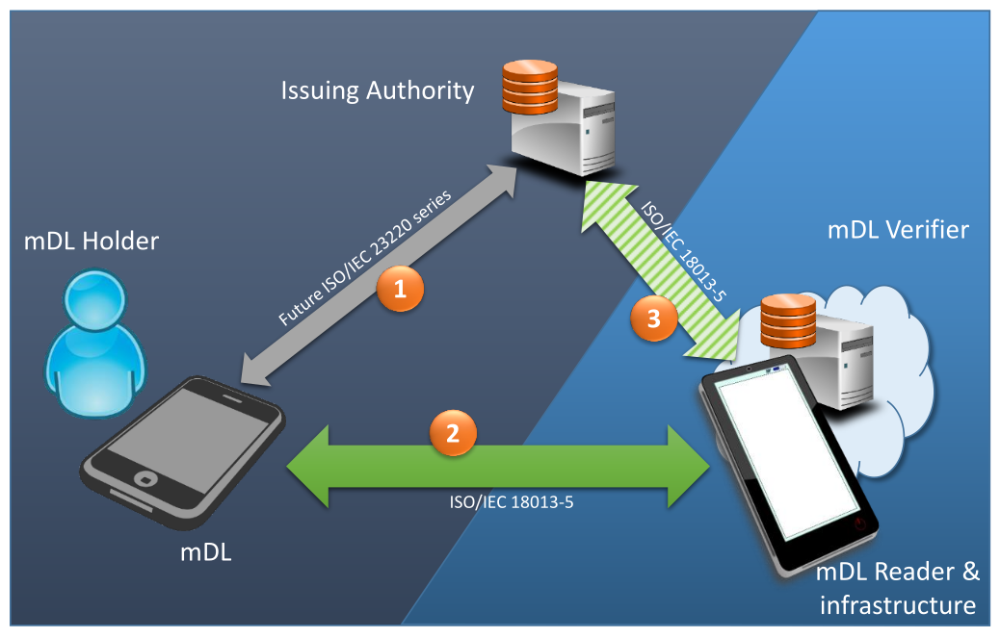
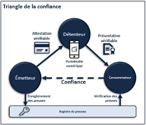

<!-- ENTETE -->

---

<!-- FIN ENTETE -->

# Veille et expérimentation sur les permis de conduire numériques
## Introduction
À l'ère de la transformation numérique, les permis de conduire numériques (mobile driver's licence, ou mDL) émergent comme une solution novatrice pour moderniser les systèmes d'identification et d'autorisation de conduite. En tant qu'alternatives aux permis physiques, les permis de conduire numériques offrent des avantages en matière de sécurité, de praticité et d'interopérabilité. Toutefois, leur mise en œuvre soulève des défis technologiques, juridiques et organisationnels, nécessitant une démarche robuste pour garantir leur succès et leur adoption à grande échelle.

L'objectif de ce document est de présenter une approche combinée de veille stratégique et d'expérimentation. La veille stratégique a permis de dresser un panorama des initiatives internationales et des tendances émergentes, offrant ainsi un cadre de référence pour alimenter un futur développement et soutenir les décideurs dans leur réflexion ainsi que dans leurs choix stratégiques et techniques. En parallèle, l'expérimentation a été un levier essentiel pour tester, valider et adapter des solutions spécifiques dans des conditions réelles, permettant ainsi de confirmer la faisabilité et l'impact des permis de conduire numériques. Ces deux approches, bien qu'utiles individuellement, révèlent tout leur potentiel lorsqu'elles sont intégrées dans un processus robuste et itératif.

Le document est structuré en quatre parties. La première présente les objectifs et les méthodologies respectifs à la veille et à l'expérimentation. La deuxième partie synthétise les résultats de la veille. La troisième partie se concentre sur la mise en place du prototype et les résultats obtenus lors des tests. Enfin, la dernière partie propose une description des enjeux et des limites de la solution, tant du point de vue technique que stratégique. 

### 1. Objectifs et méthodologie
#### 1.1. Objectifs et méthodologie de la veille

Les permis de conduire numériques représentent une évolution significative dans la gestion et la vérification des identités des conducteurs. Cette transition vers le numérique permet d’améliorer la sécurité et l’efficacité administrative. Cependant, elle soulève également des questions importantes sur la protection de la vie privée, la sécurité des données et l’interopérabilité de ce type d’identifiant numérique. Dans un contexte où la transition vers le numérique des services gouvernementaux s’accélère, comprendre les enjeux, les défis et les opportunités liés aux permis de conduire numériques devient crucial pour toute juridiction envisageant leur adoption. 

**Objectif de la veille**  

L’objectif principal de cette veille est de fournir un aperçu et une analyse de l’écosystème des permis de conduire numériques au niveau mondial. Cette veille servira de base pour éclairer les décisions stratégiques concernant le développement et la mise en œuvre potentielle d’un système de permis de conduire numérique.

**Objectifs spécifiques de la veille :**

•	Identifier les avantages et les inconvénients liés à la mise en œuvre des permis de conduire numériques.

•	Aperçu sur l’état actuel de l’adoption des permis de conduire numériques à l’échelle mondiale.

•	Comprendre les implications technologiques, juridiques et sociales liées à l’adoption des permis de conduire numériques.

•	Analyser les normes utilisées pour les permis de conduire numériques.

**Méthodologie et processus de veille et de collecte de données**

Nous avons mis en place un processus structuré pour collecter les données pertinentes pour notre veille sur les permis de conduire numériques, en ayant recours à l’outil Inoreader. Voici les principales étapes que nous avons suivies :

1. Identification des mots-clés : Nous avons défini les mots clés à explorer avec les membres de l'expérimentation.
2. Recensement manuel des sources : Nous avons identifié les sites, blogs et autres sources d’information pertinentes pour notre veille, ce qui nous a permis de constituer une base de données initiale des sources à surveiller.
3. Intégration dans Inoreader : Après l’identification des sources, celles-ci ont été intégrées dans l’outil Inoreader, permettant d’agréger et de filtrer les nouvelles informations en fonction des mots-clés prédéfinis.
4. Analyse des articles : Nous analysons les articles collectés par Inoreader en fonction de leur pertinence, puis les intégrons dans une fiche d’analyse hebdomadaire.
5. Synthèse hebdomadaire : Les articles recensés durant la semaine sont résumés afin d’extraire les principaux faits et tendances observés.

La période de recensement des articles s’est déroulée du 8 juillet au 2 septembre. À l’issue de cette phase, nous avons entamé la synthèse des résultats de la veille, qui est maintenant compilée dans ce rapport.

#### 1.2. Objectifs et méthodologie de l'expérimentation

**Objectif de l'expérimentation**  

L'objectif principal de cette expérimentation est d’explorer la faisabilité et la mise en œuvre d'un permis de conduire numérique, tout en s'assurant de sa compatibilité avec les orientations du Québec en matière d’identité numérique et les normes internationales. Cet objectif se décline en plusieurs sous-objectifs :

**Démontrer la faisabilité technique**
- Démontrer la compatibilité technique d’un permis de conduire numérique avec les orientations provinciales et internationales.
- Créer une attestation vérifiable et un registre d’attestation.

**Mécanismes de vérification et d'enregistrement**
- Créer un registre de consommateurs et expliciter les étapes de vérification du permis de conduire mobile.
- Créer un environnement représentatif du portefeuille numérique sur appareil mobile et assurer l’acheminement sécurisé du permis de conduire numérique.
- Créer un environnement représentatif du registre de preuves permettant de valider l’interopérabilité à l’échelle nord-américaine.

**Expérience utilisateur**
- Évaluer l'expérience des utilisateurs finaux (propriétaires du permis et contrôleurs routiers).

Pour atteindre ces objectifs, les étapes clés de la démarche sont les suivantes :

- Durant la phase préparatoire, suivre des formations pour mettre à niveau les connaissances technologiques requises afin de mener à bien les activités de prototypage et d’expérimentation.
- Obtenir l’appui d’experts du domaine à certains moments clés des expérimentations (ex. permis, technologies mDL, technologies chaînes de blocs).
- Partager l’état d’avancement des expérimentations avec les communautés open source impliquées et obtenir des rétroactions.
- Impliquer des équipes spécialisées en recherche d’expérience client.

Au terme de cette expérimentation, nous souhaitons avoir exploré la faisabilité technologique de la majorité des composants impliqués dans le cycle de vie complet d’un permis de conduire numérique. En cas de succès, cette démarche permettra de recueillir des informations précieuses sur le fonctionnement de ces composants, ainsi que sur l’expérience des différents utilisateurs finaux. Ces informations devraient constituer une base de connaissance solide pour orienter de potentielles initiatives futures.

### 2. Synthèse de la veille
La veille sur les permis de conduire numériques vise répondre à quatre objectifs principaux : (1) identifier les avantages et les inconvénients liés à  la mise en œuvre des permis de conduire numériques, (2) aperçu sur l'état actuel de l'adoption des permis de conduire numériques à  l'échelle mondiale, (3) comprendre les implications technologiques, juridiques et sociales liées de l'adoption des permis de conduire numériques et, (4) comprendre les normes et bibliothèques utilisées pour les permis de conduire numériques.

Les permis de conduire numériques représentent une avancée majeure dans la transformation numérique des documents d'identité. Ces permis, stockées sur des appareils mobiles tels que les smartphones, permettent aux utilisateurs de prouver leur identité et leur droit de conduire sans dépendre de documents physiques. Le permis de conduire numériques se distinguent par:

- Sécurité grâce au chiffrement avancé et à l'authentification biométrique
  
- Praticité en supprimant la nécessité de transporter des documents papier
  
- Mises à  jour en temps réel des informations par les autorités émettrices
  
- Partage sélectif des données pour protéger la vie privées des utilisateurs

Toutefois, leur adoption grande échelle fait face à  des défis tels que :
- Poblèmes d'infrastructure et dépendance à la technologie: l'absence d'une infrastructure aséquate, comme les lecteurs numériques, frine l'adoption des permis numériques et peut exclure des groupes sans accès réguliers aux téléphones intelligents

- Interopérabilité: le manque de standardisation mondile des permis de conduire numériques limite leur reconnaissance homogène entre juridictions

- Gestion des données perosnelles:  Les préoccupations liées à la protection des informations sensibles, au piratage, et à la collecte excessive de données freinent l’adoption des permis numériques

- Acceptation et adoption: La reconnaissance des permis de conduire numériques dépend d'une sensibilisation aux avantages et d'un soutien gouvernmental solide pour garantir leur déploiment et leur utilisation

 ####  Portrait des initiatives
L'adoption des permis de conduire numériques progresse de manière inégale à  travers le monde, reflétant des disparités dans les priorités, les infrastructures et les cadres réglementaire. 

**Amérique**

L’adoption des permis de conduire numériques progresse aux **États-Unis**, avec des États pionniers comme la Californie et l’Arizona qui collaborent avec des entreprises privées pour intégrer ces permis dans des applications telles qu’Apple Wallet, renforçant la sécurité grâce à la biométrie et à la cryptographie. Cependant, l’absence de politique fédérale unifiée limite l’interopérabilité entre les juridictions. Soutenue par la TSA pour une utilisation dans les aéroports via des technologies avancées comme CAT-2, cette innovation bénéficie d’un appui partiel à l’échelle nationale. Malgré ces avancées, des préoccupations liées à la protection des données personnelles et à l’utilisation de la biométrie soulignent la nécessité de cadres législatifs et d’un soutien fédéral accru pour une adoption généralisée et sécurisée.

Le **Canada** adopte une approche structurée pour le développement des permis de conduire numériques, s'appuyant sur le cadre de gouvernance CANdy, élaboré en collaboration avec les gouvernements provinciaux et IBM Consulting pour renforcer l'interopérabilité et la confiance numérique. Bien que des initiatives comme les nouveaux services en ligne de la SAAQ et le programme d'identité numérique de l’Ontario aient progressé, les permis numériques ne sont pas encore opérationnels. Les efforts actuels se concentrent sur l’élaboration de bases juridiques et organisationnelles, comme le projet de loi 82 au Québec, afin de garantir une adoption sécurisée et interopérable dans l’avenir.

En Amérique du Sud, le **Brésil** se distingue comme pionnier avec l’adoption de permis de conduire numériques disponibles depuis 2019 pour 60 millions de conducteurs, permettant un usage pratique sous format mobile ou PDF pour des contrôles et des transactions comme la location de voitures. Le **Paraguay**, quant à lui, a récemment légalisé les permis numériques avec la loi n° 7177/2023, mais leur mise en œuvre est limitée par l’absence de cadre de protection des données et des réglementations adaptées, nécessitant des réformes pour assurer leur fiabilité et le respect des droits des citoyens.

**Asie-Pacifique et moyen orient**

L’adoption des permis de conduire numériques progresse rapidement dans la région Asie-Pacifique et au Moyen-Orient, bien que les approches varient selon les pays. La **Corée du Sud** a lancé ses permis numériques à l’échelle nationale dès 2022, s’appuyant sur la blockchain et des technologies cryptographiques avancées pour garantir la sécurité, tandis que **Singapour** intègre ces permis dans sa plateforme numérique Singpass pour simplifier l’accès aux services publics. Aux **Philippines**, le système LTMS permet l’accès sécurisé à un permis numérique (eDL) reconnu légalement, intégrant des normes ISO pour renforcer l’interopérabilité. De même, **Dubaï** et l’**Arabie Saoudite** ont introduit des permis numériques, combinant biométrie et QR codes pour moderniser leurs services publics.

En Océanie, l’**Australie** enregistre une adoption rapide dans des États comme le Queensland, aligné avec la norme ISO/IEC 18013-5, et la Nouvelle-Galles du Sud, qui investit massivement dans des solutions numériques. La **Nouvelle-Zélande** expérimente également des permis numériques à travers une application pilote visant à simplifier l’accès aux services administratifs. Cette adoption régionale met en évidence une tendance croissante vers des systèmes modernes et interopérables, tout en adaptant les solutions aux priorités nationales.

**Europe**

L’Europe progresse rapidement dans le déploiement des permis de conduire numériques, avec des initiatives variées selon les pays. L’**Autriche**, la **France** et le **Portugal** ont déjà intégré ces permis dans leurs systèmes numériques, les rendant juridiquement équivalents aux documents physiques et permettant leur utilisation pour des contrôles d’identité et des transactions administratives. L’**Estonie**, pionnière en services numériques, a intégré les permis dans sa plateforme eesti.ee, tandis que la **Macédoine du Nord** et la **République tchèque** modernisent leurs services publics avec des applications comme ELI et eDokladovska, malgré des défis tels que les compétences numériques limitées.

Le **Royaume-Uni** prévoit de lancer le développement des permis numériques en 2024, combinant innovation et maintien des options physiques pour une adoption inclusive. L’**Ukraine**, malgré la guerre, continue d’innover avec son application Diia, offrant des permis numériques et d’autres services administratifs, illustrant la résilience numérique en temps de crise. Au niveau européen, l’Union européenne travaille à l’harmonisation des permis numériques via les normes eIDAS, visant l’interopérabilité et la sécurité à travers ses États membres, tout en renforçant la sécurité routière et les contrôles administratifs.

**Afrique**

L’adoption des permis de conduire numériques en Afrique est en phase émergente, avec des initiatives notables en **Afrique du Sud** et au **Nigeria**. **En Afrique du Sud**, un système de permis numériques sera lancé d'ici 2024/2025, avec une application mobile complémentaire aux cartes physiques, intégrant des fonctionnalités biométriques pour renforcer la sécurité et réduire la fraude. Parallèlement, le **Nigeria** a déjà introduit des permis numériques téléchargeables via une application mobile, offrant une solution moderne qui simplifie l’accès et réduit les risques de falsification. Ces initiatives illustrent une volonté croissante de moderniser les services gouvernementaux à travers le continent.

####  Implications sociales, légales et technologiques
##### Implications sociales 
Les expériences internationales, notamment en Australie et aux États Unis, montrent un fort potentiel d'adoption des permis de conduire numériques, comme le témoignent les millions des téléchargements enregistrés. Ce succès  laisse présager  une adoption  favorable de cette technologie dans une société comme le canada. Cependant, pour garantir une transition inclusive, plusieurs aspects doivent être pris en compte: 
- **Inclusion numérique**: Pour éviter les exclusions des populations marginalisées, comme les autochtones et les personnes âgées, il est important de maintenir des permis physiques parallèllement aux solutions numériques. Cela garntira un accès équitable àntous les citoyens, indéopendamment de leurs compétences numériques ou de leur localisation géographique. De plus, des services d'accompogneent devraient être mise en place pour aider les citoyens et les parties prenantes (corps policiers, commerce, etc.) dasns l'adoption et l'utilisation de la technologie.
- **La fracture numérique** au Canada, et plus particulièrement au Québec, se manifeste à plusieurs niveaux: **accés auux technologies** (inégalité dans la disponibilité des outils numériques et de la connexion internet), **compétences numériques** (méconnaissance des concepts comme l'identité numérique et les portefeuilles numériques, avec seulement **44%** des Québecois ayant une compréhension de ces notions), et **usage et appropriation** (une large proportion des citoyens exprime des craintes liées au vol de données personnelles ou à des difficultés en cas de vol d’identité, freinant leur adoption des technologies numériques).
- **Protection de la vie privée**: Tout comme d'autres populations, les canadiens sont sensibles aux questions de gestion des données personnelles. Aini, une gestion transparente des données sensibles, associé à des garnties solides de sécurit., est essentielle pour instaurer la confiance et encourager une adoption généralisée.

##### Implications légales et juridiques 
Le contexte politique et juridique canadien joue un rôle déterminant dans la mise en œuvre des permis de conduire numériques, particulièrement en raison de la structure fédérale du pays. Bien que les provinces soient responsables de la délivrance des permis, l’absence d’une politique fédérale unifiée peut freiner leur interopérabilité, tant au niveau national qu’international.

- **Coordination interprovinciale:** Au Canada, les permis de conduire sont délivrés et gérés par les provinces, ce qui rend indispensable une coordination interprovinciale pour assurer une reconnaissance nationale uniforme des permis numériques. La résolution commune des commissaires à la protection de la vie privée en 2022 a marqué une étape clé en appelant à l’élaboration d’un cadre législatif harmonisé. Ce cadre doit inclure des règles strictes en matière de protection des données, de transparence et d’interopérabilité, tout en favorisant la collaboration entre provinces.
- **Harmonisation internationale:** L’harmonisation internationale représente un autre défi stratégique pour le Canada, notamment dans le cadre nord-américain. L’adoption de normes comme l’ISO/IEC 18013-5 établit une base technique commune, mais ne garantit pas une reconnaissance juridique effective à l’étranger. À titre d’exemple, malgré les directives de l’AAMVA aux États-Unis, la reconnaissance des permis numériques reste fragmentée entre les États. De plus, la valeur juridique des permis numériques comme pièce d’identité varie considérablement selon les juridictions. Au Canada, une stratégie juridique claire est essentielle pour assurer la reconnaissance des permis numériques à l’étranger et soutenir leur adoption nationale.
-  **Cadre légal au Québec:** Au Québec, le projet de loi 82 propose un cadre centralisé pour l’identité numérique, confiant au ministère de la Cybersécurité et du Numérique la gestion des permis numériques. Ce cadre comprend : (1)la création d’un registre d’identité numérique national, (2)l’établissement de normes garantissant la sécurité, la qualité et la transparence des données, et l’interdiction du profilage des citoyens à partir des données numériques. Cependant, des divergences avec la loi 25, qui privilégie une gestion décentralisée des données, pourraient poser problème. Une harmonisation législative est donc nécessaire pour éviter des incohérences entre ces cadres, tout en minimisant les risques associés à un registre centralisé.
- **Acceptation par les parties prenantes:** L’acceptation des permis numériques par les forces de l’ordre et d’autres parties prenantes représente un défi majeur. L’exemple de la Géorgie aux États-Unis illustre cette problématique : bien que les permis numériques soient disponibles dans des portefeuilles numériques comme Apple Wallet, certaines forces de l’ordre refusent de les reconnaître, exigeant les versions physiques. Au Canada, une période de coexistence entre permis physiques et numériques sera nécessaire, accompagnée de formations et d’un soutien adapté pour garantir une adoption pratique.
- **Protection des données personnelles**: La protection des données personnelles est une préoccupation centrale. Bien que la LPRPDE régisse actuellement ces questions au Canada, elle nécessite une mise à jour pour répondre aux défis spécifiques de l’identité numérique. Les initiatives européennes, comme le règlement eIDAS, ou américaines, pourraient inspirer l’évolution de ce cadre législatif. La transparence sur les responsabilités des acteurs, ainsi que des mécanismes clairs de recours en cas d’incident, seront essentiels pour instaurer la confiance des citoyens.
##### Implications technologiques
L’émergence des permis de conduire numériques s’inscrit dans un contexte technologique en rapide mutation, où la sécurité des infrastructures numériques, l’accessibilité et l’adoption équitable représentent des défis majeurs. Au Canada, les cyberattaques récentes sur des réseaux gouvernementaux soulignent la vulnérabilité des systèmes existants et la nécessité d’anticiper les menaces futures, notamment avec l’arrivée de l’informatique quantique. Des solutions comme les certificats hybrides post-quantiques permettent d’assurer une transition fluide tout en renforçant la sécurité. Par ailleurs, les inégalités d’accès au numérique entre zones urbaines et rurales, particulièrement au Québec, nécessitent une infrastructure hybride capable de fonctionner en modes en ligne et hors ligne, avec des tests pilotes pour garantir une migration inclusive.

Les expériences internationales, telles que Login.gov aux États-Unis et la transition de myGOVID à myID en Australie, illustrent l’importance d’une communication claire pour prévenir la fraude et les erreurs d’adoption. Ces exemples mettent également en lumière la nécessité de combiner des solutions techniques robustes avec des stratégies d’accompagnement et de sensibilisation pour instaurer la confiance des citoyens. Au Québec, l’expérience des fraudes bancaires démontre l’urgence de renforcer la sécurité face à l’ingénierie sociale et de planifier méthodiquement le déploiement des permis numériques pour garantir une adoption sécurisée et inclusive.
####  Normes et bibliothèques
Les normes et les protocoles encadrant les permis de conduire numériques s'articulent autour d'un écosystème complexe et en constante évolution. Bien que plusieurs normes existent, nous nous concentrons sur la présentation de la norme ISO/IEC 18013-5, qui a été choisie pour notre expérimentation, tout en notant que d'autres normes comme l'ISO/IEC 18013-7, le règlement eIDAS en Europe et les directives AAMVA aux états unis sont détaillées dans le document de veille (**ajouter référence**). 

##### Étude de la norme ISO/IEC 18013-5
L'ISO/IEC 18013-5 est une norme internationale qui définit les spécifications des permis de conduire mobiles (mobile Driver's License - mDL). L'étude de la norme était un prérequis à la réalisation de cette expérimentation. Nous devions rapidement comprendre sa structure générale, le modèle de données, les protocoles de communication, les mécanismes de sécurité, les fonctionnalités de confidentialité, l'interopérabilité et les cas d'utilisation qu'elle supporte.

#### Composants principaux
Comme pour l'infrastructure d'identité numérique, l'éco-système mDL se compose de trois éléments principaux (le fameux triangle de confiance):

1. L'infrastructure de l'autorité émettrice;
2. Le mDL lui-même, enregistré sur l'appareil mobile du détenteur du permis;
3. Le lecteur mDL, utilisé pour vérifier un mDL.

#### Caractéristiques clés

##### Éléments de données et sécurité
Le mDL contient des éléments de données spécifiques sur le détenteur du permis, tels que son nom, sa date de naissance ainsi que ses privilèges de conduite. Ces éléments de données sont protégés par des mécanismes cryptographiques et des certificats numériques gérés par une infrastructure à clé publique (PKI) sous le contrôle d'une autorité émettrice.

##### Intégrité des données et authentification
Le mDL inclut un objet de sécurité mobile (MSO) qui contient un condensé des éléments de données. Ce dernier est signé numériquement par l'autorité émettrice. Cela permet aux lecteurs mDL de vérifier l'intégrité et l'authenticité des éléments données, en plus de permettre l'authentification de l'autorité émettrice par l'utilisation de la liste vérifiée des autorités émettrices de certificats (VICAL).

##### Protection de la vie privée
Une des caractéristiques clés offerte par un mDL est la divulgation sélective, permettant aux détenteurs de partager uniquement le sous-ensemble nécessaire de leurs informations personnelles. Les éléments de données divulgés varient en fonction du cas d'utilisation.

##### Processus d'utilisation du mDL

- **Initialisation** : Le détenteur présente son mDL à un lecteur mDL pour vérification.
- **Demande de preuve** : Le lecteur mDL demande les éléments de données à valider à l'appareil du détenteur.
- **Consentement** : Le détenteur reçoit une invite montrant les éléments de données demandés et doit consentir à les partager.
- **Transmission** : Après consentement, les éléments de données du mDL, y compris l'objet de sécurité mobile (MSO), sont partagées via une communication sécurisée avec le lecteur.
- **Vérification** : Le lecteur mDL valide l'intégrité des éléments de données reçues en vérifiant la signature de l'objet de sécurité mobile (MSO) et en contrôlant le hachage de chaque élément de données individuellement.

##### Technologies de communication
Le détenteur d'un mDL peut échanger des informations avec les lecteurs en utilisant la communication en champ proche (Near Field Communication ou NFC), le Bluetooth Low Energy (BLE) ou le Wi-Fi Aware.

##### Modèle de confiance
Pour mettre en place un modèle de confiance, la norme ISO/IEC 18013-5 définit une infrastructure à clé publique (PKI) décentralisé. Les lecteurs mDL doivent posséder la chaîne de certificats de signature mDL de l'autorité émettrice pour vérifier son authenticité.

En normalisant ces aspects, la norme ISO/IEC 18013-5 vise à assurer l'interopérabilité, la sécurité et la confidentialité dans la mise en œuvre et l'utilisation des permis de conduire mobiles à travers différentes juridictions et cas d'utilisation.

Il est important de noter que malgré l'existence de cette norme internationale, de nombreuses initiatives nationales suivent leurs propres standards. cette divergence souligne un défi majeur pour l'interopérabilité internationale future des permis de conduire numériques.

##### Analyse des bibliothèques et outils techniques

Tout au long de cette expérimentation, une analyse des applications/bibliothèques existantes nécessaires à l'implémentation de la norme ISO/IEC 18013-5 mDL a été menée. Dans le cadre de cette expérimentation, des bibliothèqyes et outils compatibles avec la norme ISO/IEC 18013-5 mDL ont été explorés(NB: La pile technologique utilisé dans nos expérimentations précédentes sur l'identité numérique était principalement basé sur les languages Python ([ACA-Py](https://github.com/openwallet-foundation/acapy)) et TypeScript ([Portefeuille-mobile-qc](https://github.com/MCN-ING/Portefeuille-mobile-qc))). Voici la decription des principaux: 

1. [Kotlin Multiplatform mdoc library](https://github.com/walt-id/waltid-mdoc): Une librairie mdoc multi-platforme en langage Kotlin qui permet de créer des attestations au format mdoc conforme à la norme ISO/IEC 18013-5 mDL.

2. [Google identity-credential](https://github.com/openwallet-foundation-labs/identity-credential): Un dépôt qui contient des bibliothèques et des applications (détenteur et vérificateur) pour travailler avec des identités du monde réelles. L'objectif initial était d'implémenter les mdoc/mDL conformes à la norme ISO/IEC 18013-5 et aux normes associées (principalement la série ISO 23220 et ISO 18013-7), mais la portée actuelle inclut également d'autres formats d'attestation.

3. [pyMDOC-CBOR](https://github.com/IdentityPython/pyMDOC-CBOR): Un analyseur/générateur en Python pour les attestations de Type 1 et également pour les cas d'usage mDL. Ce projet est une proposition expérimentale née d'un projet éducatif.

À l'exception de l'application de vérification disponible dans le projet [Google identity-credential](https://github.com/openwallet-foundation-labs/identity-credential), nous n'avons pas trouvé d'autres implémentation en code source ouvert. 

Au cours de cette expérimentation, les implémentations disponibles de la norme ISO/IEC 18013-5 ont évolués. Un acteur majeur du monde SSI, la bibliothèque [credo-ts](https://github.com/openwallet-foundation/credo-ts), a ajouté le support du mDL. Au moment d'écrire ce rapport, le code n'était pas complété mais cet ajout est intéressant pour le développement d'un portefeuille multi-formats. En plus de supporter les [AnonCreds](https://hyperledger.github.io/anoncreds-spec/), la bibliothèque credo-ts supportent les [attestations vérifiables W3C](https://www.w3.org/TR/vc-data-model/), les [attestations vérifiables SD-JWT](https://www.ietf.org/archive/id/draft-ietf-oauth-sd-jwt-vc-01.html), le protocol OID4VC et prochainement, le mDL. Ainsi, le [Portfeuille mobile QC](https://github.com/MCN-ING/Portefeuille-mobile-qc) pourra devenir un portefeuille multi-formats.
Pour conclure, les permis de conduire numériques incarnent une avancée prometteuse vers une identification moderne et sécurisée. Malgré des défis d'interopérabilité, de sécurité et d'inclusion, leur adoption croissante témoigne de leur potentiel à simplifier l'accès aux services publics tout en répondant aux exigences de la transformation numérique. Une mise en œuvre réussie dépendra d'un équilibre entre innovation, réglementation harmonisée et inclusion sociale.

### 3. Mise en œuvre et résultats de l'expérimentation
L'expérimentation vise à matérialiser l’ensemble du cycle de vie d’un permis de conduire mobile. En cas de succès, nous pourrions obtenir des informations utiles sur le fonctionnement du permis de conduire mobile, ainsi que sur l’expérience des différents utilisateurs finaux. Ces informations devraient constituer un substrat de qualité pour des initiatives futures sur le développement d’un permis de conduire mobile au Québec et en Amérique du Nord.

#### 3.1. Contexte

Le déploiement des **permis de conduire numériques (Mobile Driver’s License – mDL)** repose sur un ensemble de normes et de standards nationaux, tels que la norme **ISO 18013-5 (mDL)** ainsi que de **l’identité numérique (Digital Identity – eID)** et les recommandations de **l’American Association of Motor Vehicle Administrators (AAMVA)** pour l'Amérique. À l'échelle canadienne, le **Pan-Canadian Trust Framework (PCTF)** du **Digital Identity and Authentication Council of Canada (DIACC)** vient établir les grandes orientations et balises pour le déploiement de l’identité numérique.

Cependant, ces cadres présentent des lacunes en matière d’interopérabilité et de compatibilité, limitant leur viabilité dans le monde réel. Afin de garantir une expérience utilisateur intuitive et une acceptabilité auprès des parties prenantes (les forces de l’ordre, les contrôleurs routiers et les usagers de la route), le **Centre Québécois d’Excellence numérique (CQEN)** a développé un prototype québécois du permis de conduire numérique. Ce dernier s'aligne avec les orientations gouvernementales en matière d’identité numérique ainsi que le cadre mDL établi par ISO et l’AAMVA.

Bien que l’expérimentation ait été menée de manière autonome, elle s'inscrit dans un contexte où permis de conduire et identité numérique sont étroitement liés. Il est donc essentiel de prendre en compte les principes du cadre de confiance édictés par le `Conseil d’identification et d’authentification numériques du Canada (CCIAN)` et les orientations du programme gouvernemental québécois d’identité numérique dans la réalisation de l’expérimentation.

Dans ce contexte, quatre scénarios potentiels ont été identifiés :

1. La création d’un permis de conduire mobile reposant uniquement sur l’expérience et l’infrastructure développée pour l’identité numérique, notamment sur la blockchain pancanadienne d’identité numérique CANDY.
   1. S’appuie sur le travail effectué par le Joint Council – Jurisdictional Experts on Digital Identity (JC-JEDI)

2. La création d’un permis de conduire numérique reposant uniquement sur les normes de l’ISO 18013-5 complétées par les lignes directrices de l’AAMVA.

3. La création d’un permis de conduire mobile reposant sur l’infrastructure de l’identité numérique existante conforme aux spécificités techniques de la norme ISO 18013-5.

4. La dérivation d’un permis de conduire numérique à partir de l’identité numérique.

Nous privilégions le scénario 2 avec pour objectif principal la conformité avec les standards de l’ISO complétés par les lignes directrices de l’AAMVA. En conséquence, nous avons poursuivi la réalisation de quatre prototypes touchant l’émission du document, la création et la gestion du registre de preuves, la détention et la vérification du document.

**Vision générale de l'écosystème du mDL**

Bien que l’expérimentation ait permis de poser des bases solides pour le développement d’un permis de conduire numérique conforme aux standards internationaux, plusieurs enjeux stratégiques et opérationnels ont été identifiés, influençant la portée et les résultats de cette première phase. Voici les principaux enjeux et exclusions qui ont émergé au cours de cette phase d’expérimentation.

#### Enjeux identifiés

- Marché peu mature en matière de mDL et expertises/solutions silotées par fournisseurs. Rend plus difficile la prise de connaissances et la formation;

- Il faudra discuter des modalités de publication de nos résultats auprès de la communauté de pratique Open Source;

- La participation des équipes de recherche ne sera pas requise si nous ne pouvons pas aller auprès des utilisateurs. Notamment, nous ne pourrons pas connaître s’il y a une perception positive vis-à-vis du permis numérique;

- Disponibilité des ressources stratégiques (ex. Experts permis, Experts de certaines technologies);

- Caractère innovant de la solution : La solution, par son caractère novateur, impose des efforts accrus pour tester et valider les approches;

- Nécessité d’interopérabilité avec l’écosystème mDL et eID canadien et américain;

- La disponibilité des membres de l’équipe noyau a été un enjeu depuis le début du projet d’expérimentation. La planification a été ajustée pour tenir compte de cet enjeu;

- L’équipe partenaire rencontre des blocages pour la consultation des experts et spécialistes en lien avec le permis;

#### Exclusions de la portée du projet

- Cette première phase d’expérimentation a couvert l’interopérabilité dans l’écosystème nord-américain. L’interopérabilité à l’échelle internationale, et plus spécifiquement avec le territoire européen, sera déterminée dans une deuxième phase, le cas échéant;

- Cette phase d’expérimentation n'a pas couvert les parties prenantes du secteur privé qui pourraient devoir utiliser un éventuel permis numérique québécois (ex. concessionnaires automobiles, entreprises de location de voitures/camions, etc.);

- Les prototypes finaux ne seront pas des fondations réutilisables dans l’écosystème d’identité numérique et de permis numérique québécois. Si les résultats s’avèrent concluants, il faudra prévoir une phase projet pour détailler la solution d’affaires cible, et ce, conformément aux exigences de la LGGRI.

### 3.2 Mise en place d'un prototype
Afin de comprendre le cycle de vie complet d'un permis de conduire mobile dans le contexte des attestations vérifiables, nous avons décidé de créer un prototype qui implémente les composantes majeures suivantes : Émetteur, détenteur, vérificateur et Infrastructure à Clés Publiques (ICP).

- **Émetteur :** Il est responsable de l'émission du permis de conduire mobile. Comme nous avions déjà un émetteur ([ACA-Py](https://github.com/openwallet-foundation/acapy)) utilisé dans le projet d'identité numérique et que ce dernier supporte un système d'extensions, nous avons décidé de l'utiliser comme émetteur. Une extension supportant le protocole d'émission OID4VCI était déjà disponible. Le code de la bibliothèque [pyMDOC-CBOR](https://github.com/IdentityPython/pyMDOC-CBOR) pouvait être utilisé pour permettre à [ACA-Py](https://github.com/openwallet-foundation/acapy) d'émettre un permis de conduire mobile au format mDL.

- **Détenteur :** Le projet d'identité numérique utilise le [Portefeuille mobile QC](https://github.com/MCN-ING/Portefeuille-mobile-qc). Ce dernier est développé en React Native (Typescript). Au moment où l'expérimentation a commencé, nous n'avions pas de bibliothèque assez avancée en Typescript qui implémentait la norme ISO 18013-5 mDL. Nous avons décidé de convertir le code de la bibliothèque [Kotlin Multiplatform mdoc library](https://github.com/walt-id/waltid-mdoc) en TypeScript.

- **Vérificateur :** Il est responsable des demandes de vérification d'un permis de conduire mobile. Comme il n'existait pas d'application de vérification en code source ouvert au moment où l'expérimentation a commencé, nous avons décidé d'en développer une en React Native (Typescript). Il était requis que cette dernière supporte, au minimum, les demandes de preuve sans connexion via le protocole BLE (exigence de la norme ISO 18013-5 mDL).

- **Infrastructure à Clés Publiques :** L'ICP joue le rôle de registre de confiance central dans l'architecture de l'application mDL. Elle crée et gère les paires de clés (publiques et privées) ainsi que les certificats numériques attribués aux autorités émettrices de permis de conduire. Cette infrastructure permet de vérifier de manière cryptographique et sans équivoque qu'un document a été émis par une autorité légitime à travers des signatures numériques. Cette infrastructure est essentielle pour garantir la sécurité, l'authenticité et la fiabilité du système mDL dans son ensemble.

### 3.3. Configuration et installation 

#### 3.3.1 ICP / PKI (Infrastructure à clé publique / Public Key Infrastructure)

La PKI Interne de Développement CQEN Dev V1 est créée pour donner support aux activités de développement dans un contexte d'expérimentation qui ont besoin d'une PKI fonctionnelle. 

Dans un premier temps, elle servira à fournir l'infrastructure de certification nécessaire pour l'expérimentation du permis de conduire mobile (Mobile Driver's Licence mDL), et permettre l'émission des certificats numériques qui seront ajoutés à la `VICAL - verified issuer certificate authority list` (Liste des autorités de certification des émetteurs vérifiés) de l'AAMVA.   

Des informations détaillées sur la structure de la PKI Interne de Développement sont disponibles dans le document [ICP Interne de Développement CQEN Dev V1](./pki.md). 

### Configuration de l'ICP Expérimentale du Gouvernement du Québec

#### Configuration des fichiers de paramètres dans le répertoire de scripts

La configuration de l'ICP se fait à partir de l'édition d'un fichier de paramètres général, appelé `base.params`, et d'un fichier de paramètres par AC créé (p. ex. `cqen.params`, etc). 

La configuration du fichier général doit prendre en considération les paramètres suivants : 

| Nom du paramètre | Obligatoirité | Valeur | Exemple | 
|---|---|---|---|
| PROJECT_HOME | O | Répertoire dans lequel les sources du projet GitHub ont été clonées et à partir duquel l'ICP sera compilée et construite. | /home/usu/code-source/pkiCloneGithub |
| PROJECT_BKP_HOME | O | Répertoire de sauvegarde des scripts et des fichiers de configuration des sources de l'ICP. Référer comme un sous-répertoire de `$PROJECT_HOME`. | /bkp |
| PROJECT_SRC_HOME | O | Répertoire des sources des scripts et de configuration de l'ICP. | /sources |
| PKI_HOME | O | Répertoire cible où l'installation de l'ICP sera faite. | /pki-gouvernementale |
||||

Ensuite, il faut configurer le fichier des autorités de certification qui seront créées. 

| Nom du paramètre | Obligatoirité | Valeur | Exemple | 
|---|---|---|---|
| CQEN_ROOT | O | Répertoire racine de l'autorité de certification. `$PROJECT_HOME/ca`. | $PKI_HOME/ca/cqen |
| CQEN_CONF | O | Fichier de configuration d'OpenSSL de l'autorité. | $CQEN_ROOT/config/openssl.conf |
| CQEN_PASSWORD_FILE | O | Fichier de mot de passe. Ce fichier est déposé dans un répertoire protégé, et le mot de passe sera généré automatiquement par le générateur de chiffres aléatoires d'OpenSSL. | $CQEN_ROOT/private/ca_password.txt |
| CQEN_CN | O | Identificateur au format de `distinguished name`, qui servira à identifier l'autorité dans l'arborescence de l'ICP. | /C=CA/ST=QC/O=Gouvernement du Quebec/CN=Autorite de Certification Intermediaire CQEN Dev v1 |
| CQEN_OCSP_URL | O | Adresse qui rendra disponible l'endpoint de consultation à l'OCSP. | http://ocsp.icpgouvernementaleqc.apps.exp.openshift.cqen.ca |
| CQEN_CRL_URL | O | Adresse qui rendra disponible la liste des certificats révoqués (CRL). | http://crl.icpgouvernementaleqc.apps.exp.openshift.cqen.ca/cqen/dev/v1/ca.crl |
| OCSP_CONF | O | Fichier de configuration d'OpenSSL de l'OCSP. | $CQEN_ROOT/config/ocsp.conf |
| CQEN_OCSP_PASSWORD_FILE | O | Fichier de mot de passe du serveur de l'OCSP. Ce fichier est déposé dans un répertoire protégé, et le mot de passe sera généré automatiquement par le générateur de chiffres aléatoires d'OpenSSL. | $CQEN_ROOT/private/ocsp_password.txt |
||||

Finalement, il suffit de lancer le script de déploiement, `$PROJECT_SRC_HOME/deploy.sh`, l'ICP sera installée sous le répertoire `$PKI_HOME` en déployant l'Autorité Racine et toutes les Autorités Intermédiaires et finales configurées. 

#### 3.3.2 Plugin aca-py 

Le plugin aca-py pour ajouter du support aux clés ECDSA et aux certificats numériques X509 peut être configuré en suivant la documentation à la page de [configuration du plugin aca-py](./plugin-acapy.md).

#### 3.3.3 Application émettrice 

L'application émettrice est un ensemble de deux composants : une API (backend) et une application web (frontend) :
- "backend" : API d'un agent ACA-Py (Hyperledger Aries Cloud Agent Python) qui gère l'offre de l'attestation (accepter, refuser, etc.).
  - [Consulter la procédure d'installation](../aca-py-oid4vci/README.md)
- "frontend" : Application web qui permet à l'utilisateur de fournir ses informations pour le permis de conduire mobile et aussi de faire les appels à l'API ACA-Py pour l'émission du permis.
  - [Consulter la procédure d'installation](../issuer-frontend/README.md)

#### 3.3.4 Portefeuille mobile mDL
Pour être en mesure de tester l'émission d'un mDL, une application mobile de type portefeuille numérique a été développée. Pour l'utiliser, [Consulter son dépôt](https://github.com/CQEN-QDCE/portefeuille-mobile-mdl/) et suivre la procédure d'installation.

### 4.Forces et limites de la solution
L'hypothèse d'expérimentation avait comme objectif de démontrer qu'un permis de conduire numérique peut être conservé dans un portefeuille numérique; tout en respectant les normes de l'indentité numérique ainsi que les normes du permis de conduire numérique (ISO 18013-5 - mDL et l'AAMVA).

Nous avons structuré l'expérimentation en deux phases:
- Phase d'exploration et d'analyse de l'ecosystème du permis de conduire mobile.
- Phase d'implémentation du cycle de vie complet d'un permis de conduire numérique dans le contexte des attestations vérifiables:

    

  - Émetteur: Mettre en place une solution émettrice du permis de conduire numérique
  - Détenteur: Mettre en place un portefeuille numérique qui supporte le permis de conduire numérique
  - Vérificateur: Mettre en place la vérification du permis de conduire numérique
  - Infrastructure de Clés Publique (ICP): Mettre en place une ICP pour l'intégrer à l'ecosystème du permis de conduire numérique.

### 4.1 Exploration et analyse de l'ecosystème du permis de conduire

L'Exploration et l'analyse de l'ecosystème du permis de conduire est un succès:

- ✅ Détermination de quatre possibles scénarios de solution
  - Sélection du scénario 2 (mDL) qui réprésentait le scénario moins connu.
- ✅ Comprehénsion et apprentissage de la norme ISO 18013-5
- ✅ Comprehénsion des contraintes imposées par le Guide d'Implementation de l'AAMVA et son impact sur l'architecture du projet. 

### 4.2 Implémentation du cycle de vie complet d'un permis de conduire numérique dans le contexte des attestations vérifiables

#### 4.2.1 Émetteur: Mettre en place une solution émettrice du permis de conduire numérique

- ✅ Un agent ACA-Py avec les plugins OID4VCI ("OpenID for Verifiable Credential Issuance") et mso-mdoc ("Mobile Security Object") a été deployé pour l'émission d'un permis de conduire mobile au format mDL.
  - Le plugin OID4VCI pour l'émission d'une attestation vérifiable.
  - Le plugin mso-doc pour l'authentication (signature) de l'émission.
- ✅ Un prototype d'application web frontend (contrôller) a été associé à l'agent ACA-Py pour la saisie des informations du permis de conduire numérique.
- ✅ Un permis de conduire numérique au format mDL a été émis.

#### 4.2.2 Détenteur: Mettre en place un portefeuille numérique qui supporte le permis de conduire numérique

- ✅ Une application portefeuille numérique a été mis en place avec la librairie [mdl-ts](https://github.com/CQEN-QDCE/mdl-ts) pour supporter le format mdoc conforme à la norme ISO/IEC 18013-5 (mDL)
- ✅ L'application de portefeuille numérique a été publié en phase de test interne dans Google Play Console pour être capable de l'installer dans un appareil Android.
- ⚠️ Il reste à publier l'application de portefeuille numérique pour un appareil iOS. 

#### 4.2.3 Vérificateur: Mettre en place la vérification du permis de conduire numérique

- ⚠️ L'application de vérification n'a pas été développée par manque de temps. Il sera probablement assez rapide d'en mettre une en place lorsque la bibliothèque credo-ts aura complétée son implémentation de la norme mDL.

#### 4.2.4 Infrastructure de Clés Publique (ICP): Mettre en place une ICP pour l'intégrer à l'ecosystème du permis de conduire numérique.

- ✅ L'ICP a été deployé dans un environnement infonuagique (Openshift).
- ⚠️ L'intégration à l'ecosystème du permis de conduire n'a pas été completé. Il reste à travailler l'ajout des certificats dans la liste de confiance VICAL ("Verifiable Issuing Certificate Authority List).

## Conclusion

Les résultats de  l'expérimentation et les observations issues de la veille mettent en lumière plusieurs dimensions de l'adoption des permis numériques, ainsi que les défis inhérents à la mise en oeuvre. Bien que l'intégration technique du standard ISO-18013-5 aux attestations vérifiables a prouvé sa faisabilité, les implications en termes de coûts et de complexité technique constituent un frein significatif pour un déploiement à grande échelle en environnement de production. Face à ce constat, une **approche hybride** plus pragmatique se dessine : le déploiement de deux identités numériques complémentaires, chacune présentant ses propres avantages et limitations spécifiques. Cette approche repose sur l'utilisation des attestations numériques au format **ANONCREDS** pour les besoins locaux dans la province (et par extension, dans le pays), en raison de son alignement avec la stratégie gouvernementale d'identité numérique, et les attestations mDL ISO-18013-5 pour les usages internationaux, grâce à leur potentiel d'interopérabilité.

Cependant, cette double approche ne peut ignorer les enjeux identifiées. Sur le plan local, l'absence de déploiements à grande échelle en environnement de production et le manque d'études de charge approfondies soulèvent des questions quant à sa viabilité pour couvrir l'ensemble des besoins provinciaux. En parallèle, bien que la norme mDL ISO-18013-5 offrent des perspectives prometteuses, leur adoption n'est pas uniforme au sein de l'AAMVA, et leur non-conformité avec la stratégie canadienne d'identité numérique complique leur intégration.

Sur le plan plus large, les permis numériques doivent faire face à des défis transversaux, notamment :

- Interopérabilité internationale : bien que soutenue par des standards comme ISO/IEC 18013-5, elle reste thèorique sans accords garantissant une reconnaissance mutuelle
- Cybersécurité : les risques liés à l’usurpation d’identité (exemple: deepfakes) et à l’émergence de l’informatique quantique nécessitent des stratégies anticipatives robustes
- Accessibilité : Une inclusion numérique est nécessaire pour ne pas marginaliser certaines populations, comme les communaautés éloignées ou les personnes âgées
- Cadre juridique : au Québec, la coexistence de la loi 25 et du projet de loi 82 pourrait créer des tensions législatives entre centralisation et décentralisation des données, soulignant la nécessité d’une harmonisation

Pour maximiser leur potentiel, les permis de conduire numériques doivent s’accompagner d’une vision claire, d’une collaboration mondiale et d’un cadre inclusif qui harmonise les initiatives locales et nationales. bien que les défis soient nombreux, cette transformation offre une opportunité unique d’améliorer l’expérience utilisateur et de moderniser les systèmes d’identification à différentes échelles.

Un tableau synthétisant les avantages et inconvénients des deux solutions sera présenté ci-dessous:

| Scénario |Attestation Type | Avantages | Inconvénients 
|---|---|---|---|
| 1.- Identité Numérique | AnonCreds | - Intégration avec la stratégie gouvernementale d'indetité numérique  - S'arrime facilement avec les travaux et l'infrastruture qui seront fournies par le programme provincial de l'identité numérique  - Il s'agit d'une technologie qui a une adoption et traction considerable à l'échélle canadienne  - Technologie connue, avec forte communauté de développeurs et de support | - On n'a pas encore eu de déploiement en large échelle, en environnement de production, des attestations numériques Anoncred  - Il manque des études et testes de charges pour s'assurer que l'infrastructure sera capable de répondre à la demande d'utilisation à la largeur de la province |
| 2.- ISO 18013-5 (mDL) | mDL ISO-18013-5 | - Standard final publié par l'ISO  - Adoption par l'association nord-américaine des autorités de transit (AAMVA)  - Potentielle interoperabilité avec les EEUU | - Le nouveau standard propose l'utilisation de plusieurs technologies et stacks technologiques qui sont très nouveaux, alors sans beaucoup d'adoption, de documentation, et de support  - N'est pas en conformance avec la stratégie canadienne d'identité numérique  - Parmi les participants de l'AAMVA, son adoption n'est pas prise pour acquis par tous. |

## Références 

### Standards à suivre 

[ISO/IEC 18013-2 - Personal identification — ISO-compliant driving licence - Part 2: Machine-readable technologies](https://www.iso.org/standard/70486.html)
[ISO/IEC 18013-5 - Personal identification — ISO-compliant driving licence - Part 5: Mobile driving licence (mDL) application](https://www.iso.org/standard/69084.html)
[AAMVA - Mobile Driver’s License (mDL) Implementation Guidelines Version 1.2](https://www.aamva.org/assets/best-practices,-guides,-standards,-manuals,-whitepapers/mobile-driver-s-license-implementation-guidelines-1-2)

### Sécurité de l'information

**FIPS 140-2 : Security Requirements for Cryptographic Modules**   

https://csrc.nist.rip/publications/detail/fips/140/2/final

Cette norme fédérale de traitement de l'information (FIPS 140-2) spécifie les exigences de sécurité qui seront satisfaites par un module cryptographique, en fournissant quatre niveaux qualitatifs croissants destinés à couvrir une large gamme d'applications et d'environnements potentiels. Les domaines couverts, liés à la conception et à la mise en œuvre sécurisées d'un module cryptographique, comprennent la spécification ; les ports et les interfaces ; les rôles, les services et l'authentification ; le modèle à états finis ; la sécurité physique ; l'environnement opérationnel ; la gestion des clés cryptographiques ; les interférences électromagnétiques/compatibilité électromagnétique (EMI/EMC) ; les auto-tests ; l'assurance de la conception ; et l'atténuation des autres attaques.

**Cryptographic Module Validation Program**  
https://csrc.nist.rip/projects/cryptographic-module-validation-program

Le 17 juillet 1995, le NIST a mis en place le programme de validation des modules cryptographiques (CMVP) qui valide les modules cryptographiques conformément aux normes FIPS (Federal Information Processing Standards) 140-1, Security Requirements for Cryptographic Modules, et à d'autres normes FIPS basées sur la cryptographie. La norme FIPS 140-2, Security Requirements for Cryptographic Modules, a été publiée le 25 mai 2001 et remplace la norme FIPS 140-1. Le CMVP est un effort conjoint du NIST et du Centre canadien pour la cybersécurité (CCCS), une branche du Centre de la sécurité des télécommunications (CST).

Les modules validés comme étant conformes à la norme FIPS 140-2 sont acceptés par les agences fédérales des deux pays pour la protection des informations sensibles.

Les fournisseurs de modules cryptographiques font appel à des laboratoires indépendants et accrédités de tests de cryptographie et de sécurité (CST) pour tester leurs modules. Les laboratoires du CST utilisent les exigences de test dérivées (DTR), les directives de mise en œuvre (IG) et les directives programmatiques CMVP applicables pour tester les modules cryptographiques par rapport aux normes applicables. La division de sécurité informatique (CSD) du NIST et le CCCS servent conjointement d'autorités de validation pour le programme, validant les résultats des tests et délivrant des certificats.
