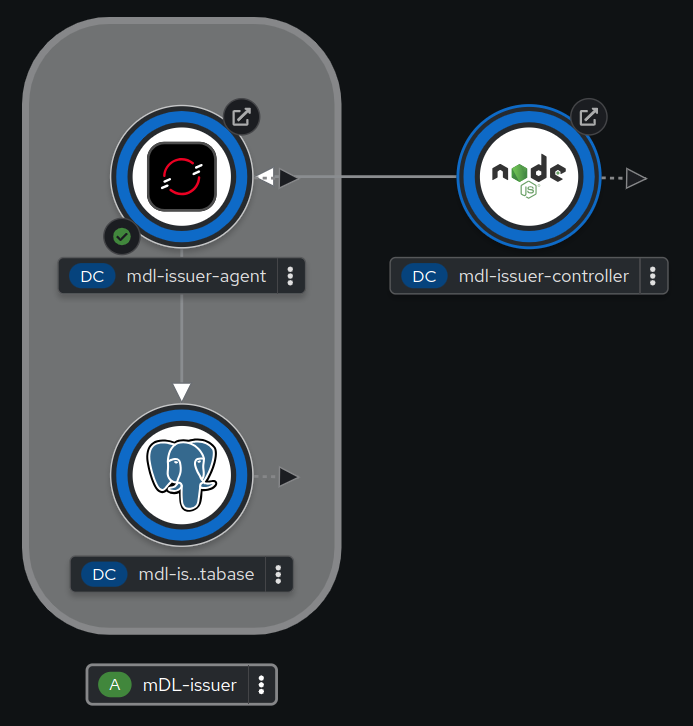

[](https://www.quebec.ca/gouv/politiques-orientations/vitrine-numeriqc/accompagnement-des-organismes-publics/demarche-conception-services-numeriques)
[](LICENCE)

---

<div>
    
</div>

## Déploiement sur Openshift

Le CQEN offre la possibilité de travailler avec Openshift comme plateforme cloudifié. Dans cette section, nous allons décrire le déploiement de chacune des applications dans cette plateforme.

**Outil de Travail: Openshift CLI**
Nous utilisons la "Ligne de Commande Openshift" (Openshift CLI) `oc client` pour la gestion de resouces dans Openshift, à partir d'un terminal. 
- Installation: Si ce n'est pas installé, voici le lien de la page de [documentation d'Openshift](https://docs.openshift.com/container-platform/4.17/cli_reference/openshift_cli/getting-started-cli.html#installing-openshift-cli) pour le faire.
- Login au cluster Openshift:
  - Obtenir un jeton de connection à partir d'Openshift avec le lien d'authentification, par exemple [Openshift CQEN](https://oauth-openshift.apps.exp.openshift.cqen.ca/oauth/token/display)
  - Login au cluster avec la commande:
    `oc login --token=<token-dans-la-reponse> --server=https://<cluster-url>:6443 `

**Stratégie de travail:**
1. Création du projet où les composants sont déployés.    
    ```bash
    oc new-project <nom-du-projet>
    ```
2. Création des fichiers de déploiement pour chaque application:
    - Fichier yaml avec le script de déploiement.
      - Par exemple application1.yaml
        ```yaml
        apiVersion: v1
        kind: Pod
        metadata:
        name: ${APP_NAME}
        spec:
        containers:
        - name: ${APP_NAME}-container
            image: <your-private-image>
        imagePullSecrets:
        - name: generic
        ```
    - Fichier de paramètres de configuration, qui peut correspondre aux variables d'environnement d'une application.
      - Par exemple application1.dev.params
        ```bash
        APP_NAME="private-reg"
        ```
3. Déploiement des resources dans Openshift
    - Assurez-vous que vous êtes dans le repertoire du script et des paramètres.
    - Procédez au déploiement dans Openshift avec la commande:
        ```bash
        oc process -f ./application1.yaml --param-file ./application1.dev.params  | oc apply -f -
        ```

### Applications

- **Application émettrice**: L'émetteur est composé d'une application API (ACA-Py agent) et d'une application frontend (controller)
    
    

  - [Détails du déploiement de l'application frontend - controller](./templates/mdl-issuer-frontend/README.md)
  - [Détails du déploiement de l'API ACA-Py agent](./templates/aca-py-oid4vci/README.md)
  
- Application de la PKI (Public key infrastructure)
  - [PKI](./templates/pki/README.md)

