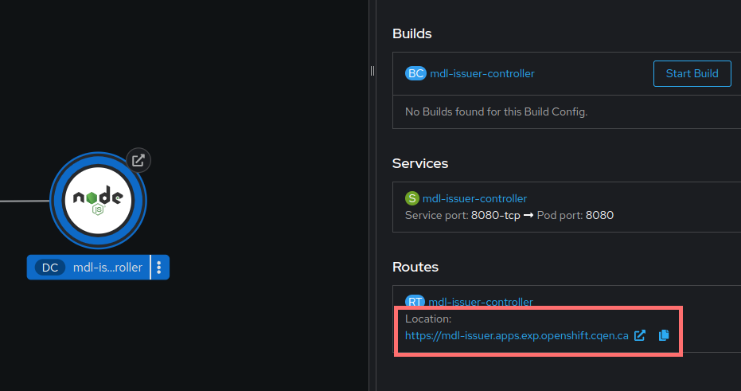

# Déploiement de l'application frontend - controller sur Openshift

Déploiement de l'application frontend, qui correspond à la partie web de l'émetteur.

## Script de déploiement

Le fichier [yaml](mdl-issuer-fe.yaml) contient le détail de chacun de resources nécessaires pour le déploiement de l'application.

## Paramètres

Éditer le fichier [mdl-issuer-fe.dev.params.example](./mdl-issuer-fe.dev.params.example), remplissez les bons valeurs et renommez le fichier par "mdl-issuer-fe.dev.params". 

Les paramètres sont les suivants:

| Paramètre | Description |
| --------- | ----------- |
| **REACT_APP_ISSUER_API_BASE_URL** | L'URL de l'API de l'agent ACA-Py émetteur. |
| **REACT_APP_OID4VCI_SUPPORTED_CREDENTIAL_ID** | L'identificateur utilisé au moment de l'appel à l'API de l'agent ACA-Py émetteur pour enregistrer les informations du permis de conduire. |

## Déploiement

Si le projet existe, allez au projet:
```bash
oc project exp-mdl
```
Si non, créez le projet sur OpenShift:
```bash
oc new-project exp-mdl
```
Lancez l'installation sur OpenShift
```bash
oc process -f ./mdl-issuer-fe.yaml --param-file ./mdl-issuer-fe.dev.params  | oc apply -f -
```

Une fois l'application deployée, vous pouvez y accéder avec le lien montré dans Openshift:

